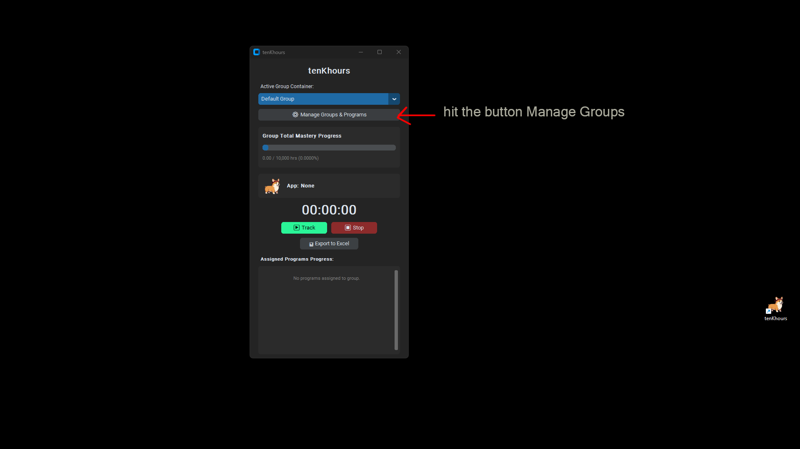
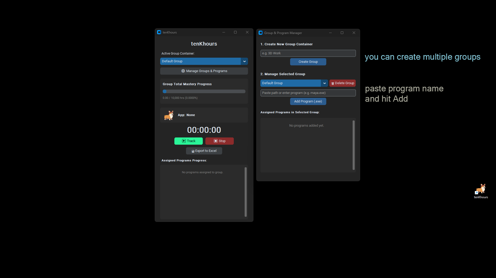
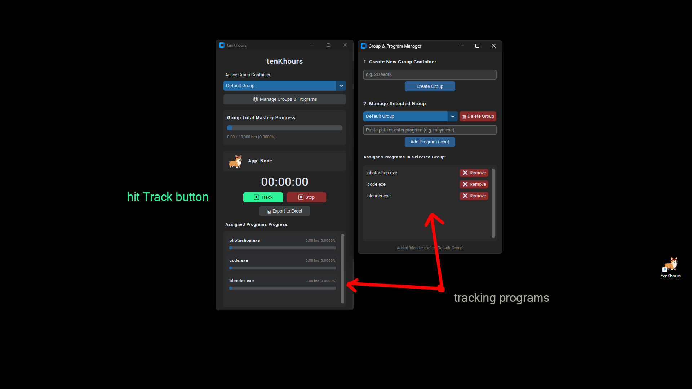
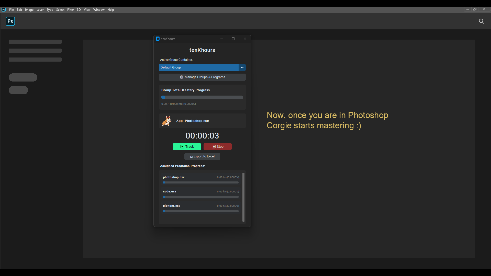
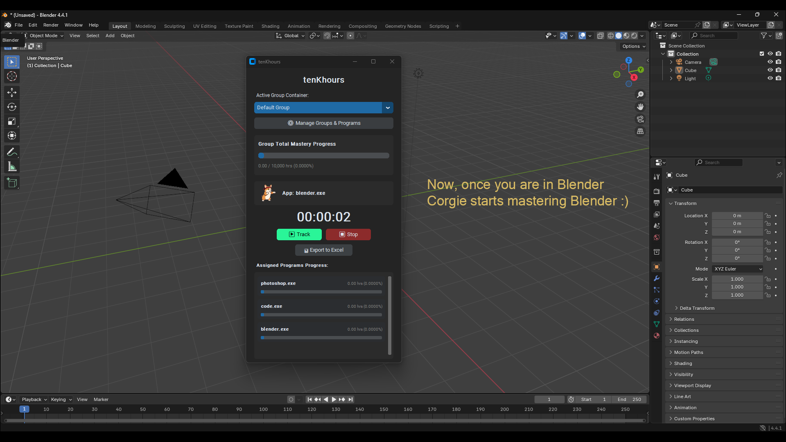

# ⏳ tenKhours

  
  
  
  

  <b>A minimalist, automated desktop tracker engineered to help creatives, software engineers, and digital artists master their crafts—one focused hour at a time.</b>

---

## 📌 Overview

The **10,000-Hour Rule** states that deep mastery in any complex discipline requires roughly 10,000 hours of deliberate practice. **tenKhours** is a Windows desktop application that runs in the background, automatically tracking the active focus time spent inside specific software environments.

Instead of generic time trackers that measure raw screen time, **tenKhours** groups your tools into **Group Containers** (e.g., *3D Modeling*, *Game Development*, *Full-Stack Coding*) and measures your individual and cumulative progress toward total mastery.

---

## ✨ Key Features

- 🎯 **Automated Window Tracking**: Detects active focus windows on Windows OS using low-level API hooks (`pywin32` + `psutil`).
- 📁 **Group Containers**: Bundle multi-application workflows (e.g., Blender + Maya + ZBrush under a single "3D Art" container).
- 📊 **Per-Program Progress Tracking**: Real-time progress bars and hour counts for every assigned `.exe` relative to your 10,000-hour goal.
- ⏱️ **Zero-Friction Live Stopwatch**: Displays precise per-session tracking and automatically updates overall group statistics in real time.
- 💾 **SQLite Storage & Persistence**: Local, crash-resilient SQLite logging ensures no lost focus time.
- 📈 **Excel Report Exports**: One-click formatting export (`.xlsx`) to review historical focus sessions with pre-formatted durations.
- 🌙 **Modern Dark Theme**: Native dark interface built on `CustomTkinter`.

---

## 🛠️ Tech Stack & Dependencies

- **GUI Framework**: [`CustomTkinter`](https://github.com/TomSchimansky/CustomTkinter)
- **OS Integration**: `pywin32`, `psutil`
- **Data & Export**: `sqlite3`, `pandas`, `openpyxl`
- **Language**: Python 3.8+

---

## 📖 App Guide

